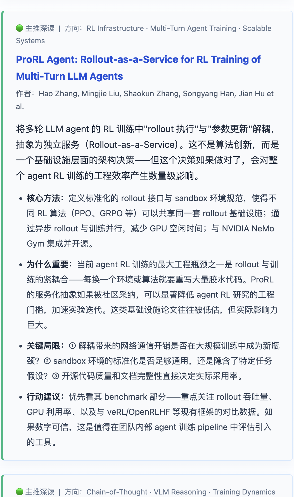
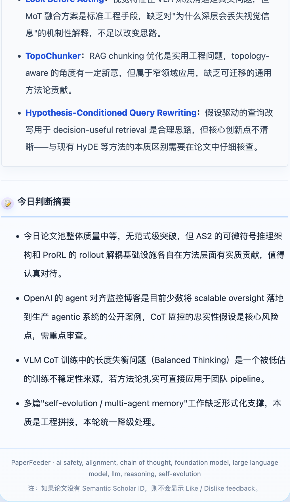

<h1 align="left">
  
  <span style="vertical-align: middle;">PaperFeeder</span>
</h1>

> A research intelligence agent pipeline for daily paper and blog triage to your email inbox.

PaperFeeder is designed around an inbox workflow: the digest is delivered by email, while the web viewer, manifests, and feedback pipeline support review, iteration, and feedback collection around that core experience.

**中文说明：** [README.zh-CN.md](README.zh-CN.md)

## Preview

<table>
  <tr>
    <td align="center"></td>
    <td align="center"></td>
    <td align="center"></td>
    <td align="center"></td>
  </tr>
  <tr>
    <td align="center"><strong>1.</strong> Overview + blog picks</td>
    <td align="center"><strong>2.</strong> Paper pick detail</td>
    <td align="center"><strong>3.</strong> Paper pick detail</td>
    <td align="center"><strong>4.</strong> Judgment summary</td>
  </tr>
</table>

### Automation Preview

GitHub Actions is the default path if you want PaperFeeder to behave like a scheduled remote service rather than a local script.

<p align="center">
  
</p>

## Why PaperFeeder

PaperFeeder is a lightweight research intelligence system for people who do not want to manually skim hundreds of links every day, and who want the final output delivered as a high-signal email digest rather than another dashboard to check.

It is built for a simple outcome:

1. ingest high-volume paper and blog streams
2. reduce them into a small, high-signal candidate set
3. generate an opinionated digest instead of a raw feed dump
4. remember what has already been shown recently
5. improve future recommendations from explicit feedback
6. run either locally or as a remote scheduled service

The product is intentionally centered on inbox delivery: email is the main delivery surface for the research brief, while the other components support that workflow.

What makes it more than a paper-summary script is the layering:

| Layer | What it adds |
|------|--------------|
| Multi-source collection | arXiv, Hugging Face daily papers, Semantic Scholar recommendations, curated blogs, optional manual sources |
| Multi-stage selection | keyword gating, coarse LLM filtering, external signal enrichment, fine reranking |
| PDF-aware synthesis | summaries can use PDFs when available, not only titles and abstracts |
| Stateful personalization | short-term anti-repetition memory is separated from long-term preference steering |
| Explicit feedback loop | per-item feedback updates future recommendation inputs |
| Deployable operations | local dry-runs, debug fixtures, GitHub Actions scheduling, Cloudflare Worker + D1 feedback path |

Core capabilities:

| Capability | Details |
|-----------|---------|
| Personalized candidate generation | user-editable interests, keywords, excluded terms, arXiv categories, and curated blogs under `user/` |
| Semantic Scholar steering | positive and negative seed papers influence recommendation fetches |
| Anti-repetition memory | `state/semantic/memory.json` suppresses recently shown items |
| Two-stage LLM filtering | stage 1 trims the pool; stage 2 reranks after external research |
| External signal enrichment | Tavily adds implementation, community, and reproducibility signals |
| Better digest writing | prompt language packs, PDF-aware inputs, HTML output for email and web |
| One-click feedback | email and web viewer links go through Cloudflare Worker + D1 |
| Reproducible artifacts | each run exports manifests and feedback templates under `artifacts/` |

## How It Works

PaperFeeder deliberately separates candidate generation, ranking, reporting, freshness, and preference learning.

### End-to-End Pipeline

1. Collect candidates from papers and blogs.
2. Apply keyword and exclusion rules.
3. Run coarse LLM filtering on title and abstract.
4. Enrich shortlisted papers with external signals.
5. Run fine LLM reranking using both content and signals.
6. Read PDFs when available and generate a polished digest.
7. Send the digest by email and optionally publish a web-view copy.
8. Persist short-term memory for anti-repetition.
9. Convert explicit feedback into future recommendation steering.

### State Model

| State | File / store | Purpose |
|------|---------------|---------|
| Short-term memory | `state/semantic/memory.json` | suppress recently seen items so the digest stays fresh |
| Long-term preferences | `state/semantic/seeds.json` | store positive / negative Semantic Scholar seed IDs |
| Per-run artifacts | `artifacts/run_feedback_manifest_*.json`, `artifacts/semantic_feedback_template_*.json` | map run items to feedback actions and offline review |
| Remote feedback queue | Cloudflare D1 | store pending 👍 / 👎 events before they are applied to seeds |

The distinction is important:

1. `memory.json` means “show this less because it was seen recently”
2. `seeds.json` means “recommend more or less of this kind of paper in the future”

Neither file changes model weights. They only change the candidate pool and recommendation inputs.

### Repository Map

```text
PaperFeeder/
├── paperfeeder/          # Main Python package
├── scripts/              # Bootstrap and feedback helpers
├── cloudflare/           # Worker source and D1 schema
├── state/semantic/       # Persistent memory and seeds
├── artifacts/            # Per-run generated manifests/templates
├── user/                 # User-editable profiles, keywords, prompt text, blogs
├── tests/                # Test suite
├── config.yaml           # Main project configuration
├── icon.png              # README / project icon
└── main.py               # Main digest entrypoint
```

Key files:

1. `paperfeeder/pipeline/runner.py`: orchestrates the full pipeline
2. `paperfeeder/pipeline/filters.py`: keyword filter plus coarse/fine LLM filtering
3. `paperfeeder/pipeline/summarizer.py`: report synthesis and HTML wrapping
4. `paperfeeder/pipeline/researcher.py`: Tavily-based external signal enrichment
5. `paperfeeder/semantic/memory.py`: anti-repetition memory store
6. `paperfeeder/cli/apply_feedback.py`: apply offline, queued, or D1 feedback into seeds
7. `cloudflare/feedback_worker.js`: one-click feedback collection and run viewer endpoint

## Local Setup And Configuration

### What You Need

| Component | Required | Why |
|----------|----------|-----|
| LLM API | Yes | digest synthesis and, if enabled, LLM filtering |
| Email provider | Optional for local preview, required for real use | deliver the digest in its intended email-first format |
| Tavily API | Optional but recommended | external signal enrichment |
| Semantic Scholar API | Strongly recommended | better ID resolution for personalization and feedback links |
| Cloudflare Worker + D1 | Optional | one-click remote feedback loop |

### Cost Profile

PaperFeeder is intentionally designed so costs stay controllable.

The main reason is architectural separation:

1. coarse and fine filtering can run on a cheap model such as DeepSeek
2. only the final digest writing step needs a stronger model such as Claude, Gemini, or GPT APIs
3. the expensive model sees only the shortlisted set rather than the full firehose
4. PDF-aware synthesis is optional and bounded by page limits, so it does not scale linearly with the raw candidate pool

In practice, this means the cheap filtering stage usually costs very little, and the dominant cost is the final synthesis pass on a much smaller set of papers and blog posts.

Rough LLM-only monthly cost, assuming 1 run per day, about 40 to 60 raw items per day, about 15 to 25 items reaching LLM filtering, about 6 to 10 shortlisted items, and PDF reading capped to the first 10 to 15 pages:

| Setup | Example routing | Rough monthly cost |
|------|------------------|-------------------|
| Budget | DeepSeek for filtering + Gemini Flash or another low-cost synthesis model | about $2 to $8 / month |
| Balanced | DeepSeek for filtering + Claude Sonnet / Gemini Pro / GPT-class synthesis | about $8 to $25 / month |
| Heavy | premium synthesis every day with more PDFs and a larger shortlist | about $20 to $50 / month |

These numbers are only order-of-magnitude estimates, not a pricing guarantee. Actual spend depends mostly on:

1. how many items survive keyword filtering
2. whether PDF-aware synthesis is enabled
3. which synthesis model you choose for the final digest
4. how often you run the pipeline

In small-team or solo-research usage, the system is generally cheap enough that model choice becomes a quality decision rather than an infrastructure problem. Optional Tavily, email, and Cloudflare costs are separate and usually modest at low volume.

### Local Setup

```bash
bash scripts/bootstrap.sh
source .venv/bin/activate
```

Then:

1. copy `.env.example` to `.env`
2. fill in local credentials for LLM, email, and optional feedback services
3. edit `config.yaml` for toggles, limits, and paths
4. edit `user/blogs.yaml` for blog sources
5. edit files under `user/` for interests, keywords, exclusions, categories, and prompt additions

Local `.env` is for local development and local testing. GitHub Actions deployments should use GitHub Secrets and Variables instead.

If you only remember one setup principle, make it this: the primary user experience is the email digest. Local preview is for iteration; production setup should be optimized around reliable inbox delivery.

### User-Editable Files

| File | What it controls |
|------|------------------|
| `config.yaml` | runtime toggles, fetch windows, path settings, prompt language, state behavior |
| `user/blogs.yaml` | blog source selection and custom feeds |
| `user/research_interests.txt` | research persona / long-form interests |
| `user/keywords.txt` | positive keyword hints |
| `user/exclude_keywords.txt` | noisy topics to suppress |
| `user/arxiv_categories.txt` | arXiv category scope |
| `user/prompt_addon.txt` | extra instruction block injected into prompts |

Config precedence:

1. `config.yaml`
2. `user/blogs.yaml`
3. environment variables
4. `user/research_interests.txt`, `user/prompt_addon.txt`, `user/keywords.txt`, `user/exclude_keywords.txt`, and `user/arxiv_categories.txt`

Preset profiles are available under `user/examples/profiles/`.

### Common Commands

Main digest:

```bash
python main.py --dry-run
python main.py --days 3
```

Sample run history:

```bash
================================================================================
PaperFeeder - 2026-03-21 21:40
================================================================================
Fetching from arXiv...
    Querying: cat:cs.LG OR cat:cs.CL OR cat:cs.AI...
    (arXiv API can be slow, ~10-60s, please wait...)
    ✓ Response received, reading data...
    ✓ Got 701986 bytes, parsing XML...
  Found 0 papers
Fetching from HuggingFace Daily Papers...
    Trying: https://huggingface.co/api/daily_papers...
    ✓ Response received, parsing...
    HuggingFace suppression: total=50, suppressed=13, forwarded=37
  Found 37 papers
Fetching from Semantic Scholar recommendations...
    📉 Semantic Scholar suppression: total=20, suppressed=11, forwarded=9
  Found 9 papers
  Semantic Scholar stats: total=20, suppressed=11, forwarded=9
Total unique papers: 46
Fetching from blogs...
📝 Fetching from 9 blogs...
  ✓ Hugging Face Blog: 4 posts
  ⚠️ Meta Research: HTTP 400
  ✓ OpenAI Blog: 5 posts
  ⚠️ Anthropic News & Research: HTTP 404
  ✓ Google DeepMind: 1 posts
  ✅ Found 10 blog posts (10 priority, 0 normal)
  Priority blogs (skip filter): 10
  Normal blogs (go through filter): 0

Filtering 46 papers...
  Keyword filter: 19 papers matched
  LLM Filter [Coarse (title+abstract)]: Processing 19 papers in 2 batches
  Batch 1/2 (10 papers)...
  Batch 2/2 (9 papers)...
  Scored 16 papers, sorting by relevance...
  LLM coarse filter: 16 papers selected for enrichment
  Using Tavily API for research

Researching 16 papers for external signals...
  [1/16] Researching: SAMA: Factorized Semantic Anchoring and Motion Ali...
  [2/16] Researching: ReasonCACHE: Teaching LLMs To Reason Without Weigh...
  [3/16] Researching: ReflexiCoder: Teaching Large Language Models to Se...
  [4/16] Researching: What Really Controls Temporal Reasoning in Large L...
  [5/16] Researching: Video-CoE: Reinforcing Video Event Prediction via ...
  [6/16] Researching: AI Scientist via Synthetic Task Scaling...
  [7/16] Researching: Reinforcement-aware Knowledge Distillation for LLM...
  [8/16] Researching: Goldilocks RL: Tuning Task Difficulty to Escape Sp...
  [9/16] Researching: Curriculum Learning for Efficient Chain-of-Thought...
  [10/16] Researching: Self-Distillation Enables Continual Learning...
  [11/16] Researching: Fanar-Sadiq: A Multi-Agent Architecture for Ground...
  [12/16] Researching: Temporal Gains, Spatial Costs: Revisiting Video Fi...
  [13/16] Researching: Expanding the Capabilities of Reinforcement Learni...
  [14/16] Researching: Doc-to-LoRA: Learning to Instantly Internalize Con...
  [15/16] Researching: OSM-based Domain Adaptation for Remote Sensing VLM...
  [16/16] Researching: BenchPreS: A Benchmark for Context-Aware Personali...
  Research complete: 16 papers enriched
  LLM Filter [Fine (with community signals)]: Processing 16 papers in 2 batches
  Batch 1/2 (10 papers)...
  Batch 2/2 (6 papers)...
  Scored 9 papers, sorting by relevance...
  LLM fine filter: selected 9 papers for final report
  Processing 9 PDFs individually...
    [1/9] ReasonCACHE: Teaching LLMs To Reason Wit...
    PDF download failed for https://arxiv.org/pdf/2602.02366.pdf...:
    [2/9] Goldilocks RL: Tuning Task Difficulty to...
    Extracted first 15 pages (total: 21)
    PDF processed: 718403 bytes -> base64 length: 957872
    [3/9] Curriculum Learning for Efficient Chain-...
    PDF download failed for https://arxiv.org/pdf/2602.17686.pdf...:
    [4/9] Temporal Gains, Spatial Costs: Revisitin...
    Extracted first 15 pages (total: 18)
    PDF processed: 2732551 bytes -> base64 length: 3643404
    [5/9] Self-Distillation Enables Continual Lear...
    Extracted first 15 pages (total: 21)
    PDF processed: 1079504 bytes -> base64 length: 1439340
    [6/9] Doc-to-LoRA: Learning to Instantly Inter...
    Extracted first 15 pages (total: 28)
    PDF processed: 562264 bytes -> base64 length: 749688
    [7/9] BenchPreS: A Benchmark for Context-Aware...
    PDF download failed for https://arxiv.org/pdf/2603.16557.pdf...:
    [8/9] Reinforcement-aware Knowledge Distillati...
    PDF has 13 pages (using all)
    PDF processed: 488497 bytes -> base64 length: 651332
    [9/9] OSM-based Domain Adaptation for Remote S...
    PDF download failed for https://arxiv.org/pdf/2603.11804.pdf...:
  Feedback manifest exported: artifacts/run_feedback_manifest_2026-03-21T13-49-26Z.json
  Feedback questionnaire template exported: artifacts/semantic_feedback_template_2026-03-21T13-49-26Z.json
  Published web viewer report to D1
  Semantic memory updated: final_selected=9, report_visible=4, seen_keys_added=12, expired_removed=0
  Email sent successfully

Pipeline complete
  Papers fetched: 46
  Blogs fetched: 10
  After keyword filter: 16
  After enrichment: 16
  Final papers: 9
  Total in report: 19
```

Debug mode with a fixed JSON fixture:

```bash
python main.py --debug-sample --dry-run
python main.py --debug-sample
python main.py --debug-sample --debug-llm-report --dry-run
python main.py --debug-minimal-report --dry-run
python main.py --debug-sample --debug-sample-path path/to/papers.json --dry-run
```

Optional: `--debug-write-memory` updates `state/semantic/memory.json` during debug sample mode.

Apply reviewed feedback from a manifest:

```bash
python -m paperfeeder.cli.apply_feedback --manifest-file artifacts/run_feedback_manifest_<run_id>.json --dry-run
python -m paperfeeder.cli.apply_feedback --manifest-file artifacts/run_feedback_manifest_<run_id>.json
```

Apply pending feedback from Cloudflare D1:

```bash
python -m paperfeeder.cli.apply_feedback --from-d1 --manifest-file artifacts/run_feedback_manifest_<run_id>.json --manifests-dir artifacts --dry-run
python -m paperfeeder.cli.apply_feedback --from-d1 --manifest-file artifacts/run_feedback_manifest_<run_id>.json --manifests-dir artifacts
```

There is also a wrapper script:

```bash
python scripts/semantic_feedback_apply.py --manifest-file artifacts/run_feedback_manifest_<run_id>.json --dry-run
```

## Remote Deployment With GitHub Actions

If you want PaperFeeder to behave like a remote service, GitHub Actions is the main deployment path. In practice, this is how you turn it into an automated email brief that lands in your inbox every morning.

### Workflow Roles

| Workflow | Purpose |
|----------|---------|
| `.github/workflows/daily-digest.yml` | run the digest on schedule, send email, persist `memory.json` |
| `.github/workflows/apply-feedback-queue.yml` | periodically merge D1 feedback into `seeds.json` |

### Required Secrets And Variables

Required GitHub Secrets for minimal remote email delivery:

1. `LLM_API_KEY`
2. `LLM_MODEL`
3. `RESEND_API_KEY`
4. `EMAIL_TO`

Common additional Secrets:

1. `LLM_BASE_URL`
2. `LLM_FILTER_API_KEY`
3. `LLM_FILTER_BASE_URL`
4. `LLM_FILTER_MODEL`
5. `TAVILY_API_KEY`
6. `SEMANTIC_SCHOLAR_API_KEY`
7. `CLOUDFLARE_ACCOUNT_ID`
8. `CLOUDFLARE_API_TOKEN`
9. `D1_DATABASE_ID`
10. `FEEDBACK_ENDPOINT_BASE_URL`
11. `FEEDBACK_LINK_SIGNING_SECRET`

Recommended GitHub Variables:

1. `SEED_STATE_BRANCH`
2. `SEMANTIC_MEMORY_ENABLED`
3. `SEMANTIC_SEEN_TTL_DAYS`
4. `SEMANTIC_MEMORY_MAX_IDS`
5. `FEEDBACK_TOKEN_TTL_DAYS`
6. `FEEDBACK_REVIEWER`

### Current Default Schedule

| Workflow | UTC | China Standard Time |
|----------|-----|---------------------|
| `daily-digest.yml` | `1 0 * * *` | every day at 08:01 |
| `apply-feedback-queue.yml` | `30 16 */3 * *` | every 3 days at 00:30 on the next day |

GitHub Actions cron is based on UTC calendar time, not a strict every-72-hours timer. A pattern like `*/3` resets at month boundaries.

### First Remote Deployment

1. push the repo to GitHub and enable Actions
2. add Secrets and Variables in the repository settings
3. manually run `Daily Paper Digest` with `dry_run=true`
4. inspect logs and artifacts
5. run it once with `dry_run=false`
6. confirm the state branch is created and updated

State handling:

1. workflows do not write runtime state back to `main`
2. they use a dedicated state branch, defaulting to `memory-state`
3. that branch stores `state/semantic/memory.json` and `state/semantic/seeds.json`

### Remote Operating Modes

Minimum useful remote setup for daily email only:

1. `LLM_*` secrets
2. `RESEND_API_KEY`
3. `EMAIL_TO`
4. `daily-digest.yml`

Full closed-loop setup:

1. everything above
2. Cloudflare Worker deployment
3. D1 database and credentials
4. `apply-feedback-queue.yml`

In the full mode, the loop is:

1. `daily-digest.yml` sends the digest
2. readers submit feedback through email or web links
3. events are stored in D1
4. `apply-feedback-queue.yml` writes them back into `seeds.json`
5. future Semantic Scholar recommendations change accordingly

## Tests

```bash
python -m unittest discover -s tests -p "test_*.py" -v
```

## Notes

1. `artifacts/` and `llm_filter_debug/` are disposable runtime outputs.
2. GitHub Actions persist `state/semantic/seeds.json` and `state/semantic/memory.json` on the state branch.